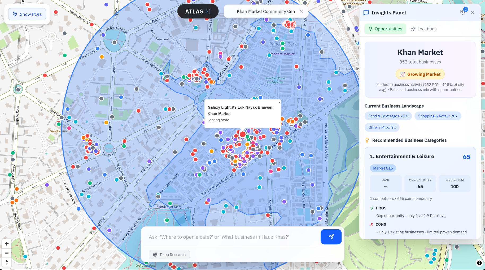
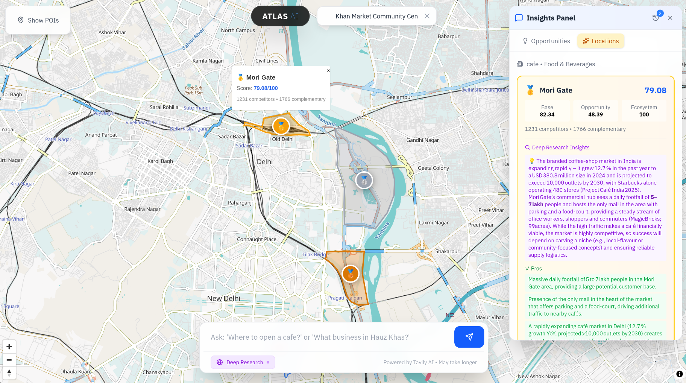
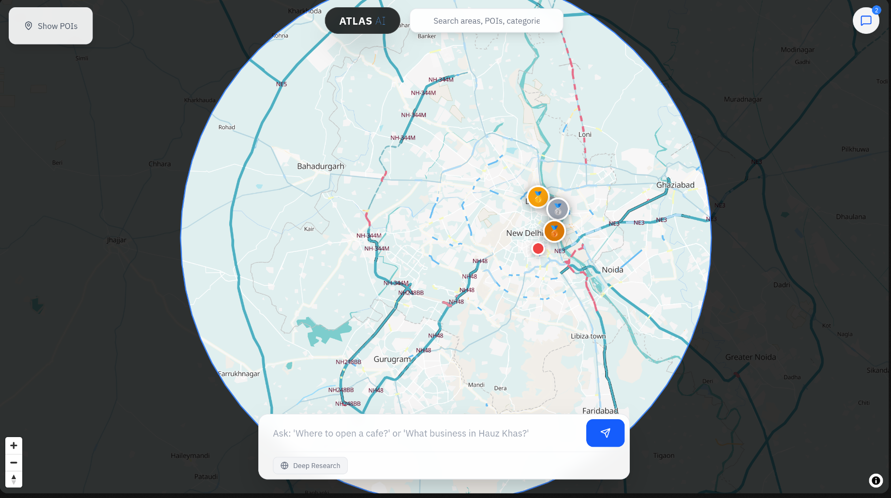
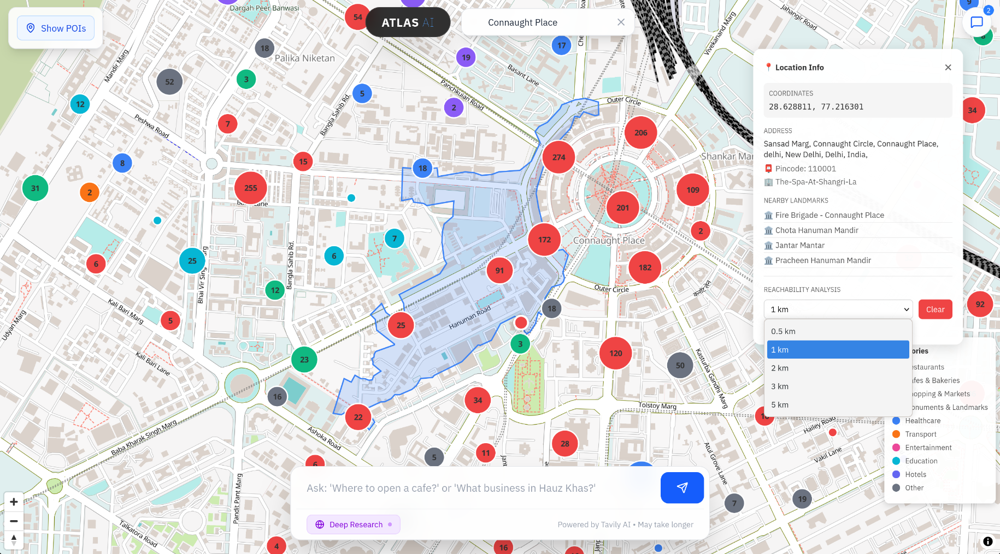
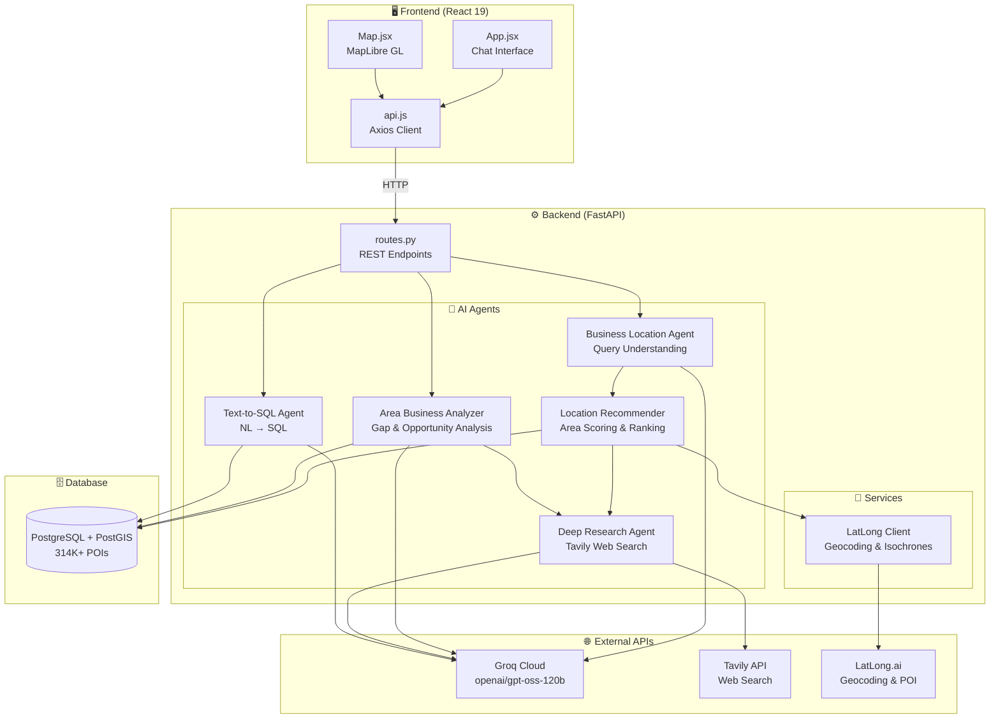
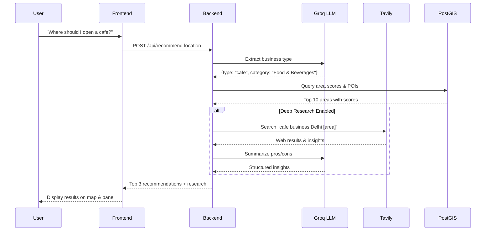
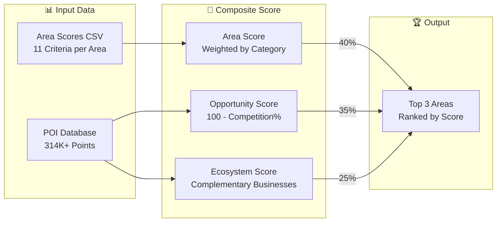

# Atlas.AI 🌍

**Atlas.AI** is an AI-powered business location intelligence platform for Delhi, India. It combines interactive maps with conversational AI to help entrepreneurs find optimal locations for their businesses and discover market opportunities.

## ✨ Features

### 🎯 Business Location Recommender
- Ask **"Where should I open a cafe?"** and get the top 3 best areas
- Scoring based on 11 criteria: footfall, rent, transit, parking, safety, and more
- Isochrone-based competitor and ecosystem analysis
- Complementary business mapping

### 📊 Area Business Analyzer  
- Ask **"What business should I start in Hauz Khas?"** 
- Gap analysis to find underserved categories
- Complementary business recommendations
- Trend indicators (Emerging 🌱 / Growing 📈 / Saturated ⚠️)


### 🔍 Deep Research (Tavily AI)
- Toggle on **Deep Research** for real-time web insights
- Pros, cons, and market analysis from current web data
- Powered by Tavily API with LLM summarization
- Markdown-formatted insights with source citations


### 🗺️ Interactive Map
- Color-coded POI markers by category
- Click areas to zoom and explore
- Layer controls for competitors, complementary businesses
- Isochrone visualization



### 💬 Chat Interface
- Natural language queries converted to SQL
- Query history with quick-recall
- Collapsible side panel for results

## 🛠️ Tech Stack

| Layer | Technology |
|-------|------------|
| **Frontend** | React 19, Vite, Tailwind CSS, MapLibre GL, react-markdown |
| **Backend** | FastAPI, Python 3.11+, uvicorn |
| **AI/LLM** | LangChain, Groq (`openai/gpt-oss-120b`) |
| **Research** | Tavily API (web search + insights) |
| **Database** | PostgreSQL 16 + PostGIS 3.4 |
| **External APIs** | LatLong.ai (geocoding, isochrones, POI) |
| **Deployment** | Docker, Docker Compose |

## 🚀 Quick Start

### Using Docker (Recommended)

```bash
# Clone the repository
git clone https://github.com/Flameingmoy/Atlas.AI.git
cd Atlas.AI

# Create environment file with your API keys
cp .env.example .env
# Edit .env and add your API keys (see Environment Variables below)

# Start all services (PostGIS, Backend, Frontend)
docker compose up -d

# Seed the database (first time only)
docker compose exec backend python scripts/seed_db.py

# Access the application
# Frontend: http://localhost:8080
# Backend:  http://localhost:8000
# PostGIS:  localhost:5433
```

### Manual Installation

```bash
# Backend
cd backend
pip install -r requirements.txt
cd ..
python scripts/seed_db.py
cd backend && uvicorn app.main:app --reload

# Frontend (in another terminal)
cd frontend
npm install
npm run dev
```

## 📖 Usage

### Business Location Search
1. Open `http://localhost:8080`
2. Type: **"Where should I open a gym?"**
3. View top 3 recommended areas with scores
4. Click any area to zoom on map

### Area Analysis
1. Type: **"What business should I start in Connaught Place?"**
2. View gap opportunities and complementary suggestions
3. Check trend indicator for market saturation

### Deep Research Mode
1. Toggle ON the **🌐 Deep Research** button
2. Submit your query
3. Wait for Tavily AI to search the web (~15-30 seconds)
4. View real-time pros, cons, and market insights

## 🗂️ Project Structure

```
Atlas.AI/
├── backend/                    # FastAPI backend
│   └── app/
│       ├── api/routes.py       # REST endpoints
│       ├── core/db.py          # PostGIS connection
│       ├── models/schema.py    # Pydantic models
│       └── services/
│           ├── ai_agent.py              # Chat agent with tools
│           ├── business_location_agent.py # Location recommender agent
│           ├── location_recommender.py   # Scoring & ranking logic
│           ├── area_business_analyzer.py # Gap & opportunity analysis
│           ├── deep_research_agent.py    # Tavily web research
│           ├── text_to_sql_service.py    # NL to SQL conversion
│           └── latlong_client.py         # External API client
├── frontend/                   # React frontend
│   └── src/
│       ├── App.jsx             # Main app with chat UI
│       ├── components/
│       │   ├── Map.jsx         # MapLibre GL map
│       │   └── LayerControl.jsx
│       └── services/api.js     # Backend API client
├── data/                       # CSV data files
├── scripts/                    # Database seeding
├── docs/                       # Documentation
└── docker-compose.yml          # Container orchestration
```

## 📚 Documentation

### Architecture
- [Overview](docs/architecture/overview.md) - System architecture and core concepts
- [Technical Design](docs/architecture/design.md) - Detailed design with diagrams

### Setup
- [Installation Guide](docs/setup/installation.md) - Docker and manual setup
- [Database Seeding](docs/setup/database-seeding.md) - Populate with sample data
- [Map Configuration](docs/setup/map-configuration.md) - Configure map tiles

### API Reference
- [Database Schema](docs/api/database-schema.md) - PostGIS tables and spatial queries
- [REST API](docs/api/rest-api.md) - Endpoint documentation
- [Text-to-SQL](docs/api/text-to-sql.md) - Natural language query system

### Guides
- [Development Guide](docs/guides/development.md) - Contributing guidelines
- [Migration Notes](docs/guides/migration-notes.md) - Version history

## 🔑 Environment Variables

| Variable | Description | Required |
|----------|-------------|----------|
| `GROQ_API_KEY` | Groq API key for LLM | ✅ Yes |
| `LATLONG_TOKEN` | LatLong.ai API token | ✅ Yes |
| `TAVILY_API_KEY` | Tavily API key for deep research | ⚪ Optional |
| `DB_HOST` | PostGIS host | No (default: `db`) |
| `DB_PORT` | PostGIS port | No (default: `5432`) |
| `DB_USER` | PostGIS user | No (default: `atlas`) |
| `DB_PASSWORD` | PostGIS password | No (default: `atlas_secret`) |
| `DB_NAME` | PostGIS database | No (default: `atlas_db`) |

### Get API Keys
- **Groq**: [console.groq.com](https://console.groq.com) (free tier available)
- **LatLong.ai**: [latlong.ai](https://latlong.ai)
- **Tavily**: [tavily.com](https://tavily.com) (free tier: 1000 searches/month)

## 🧪 Test Queries

### Location Recommendations
```
Where should I open a cafe?
Best location for a gym in Delhi?
I want to start a clothing boutique
Where to open a dental clinic?
```

### Area Analysis
```
What business should I start in Hauz Khas?
Business opportunities in Connaught Place?
What should I open in Dwarka?
Recommend business for Greater Kailash
```

## 🏗️ System Architecture



### Data Flow



### Scoring Algorithm



## 📄 License

This project is licensed under the GNU General Public License v3.0 - see the [LICENSE](LICENSE) file for details.
